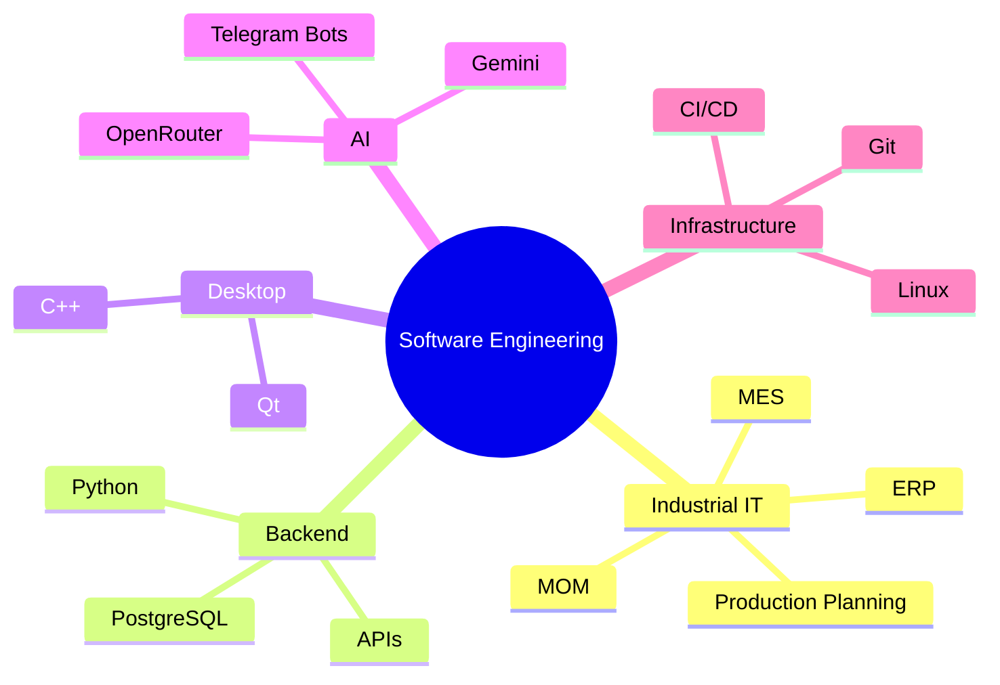
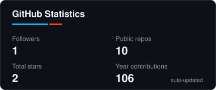
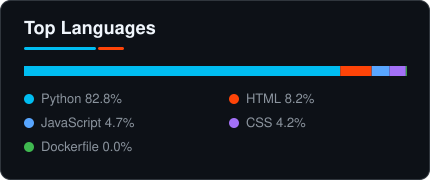
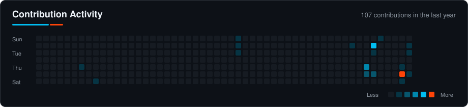

<div align="center">

# 👋 Hi, I'm Ilya

### Software Engineering • Industrial IT • Backend • AI


</div>

---

## 👨‍💻 About Me

I'm **Ilya**, a software engineering student interested in building practical software and exploring how real industrial information systems work.

My main areas of interest are:

* 🏭 **MES / MOM and industrial IT**
* 🐍 **Python backend development**
* 🗄️ **Databases and PostgreSQL**
* 🤖 **AI integrations and Telegram bots**
* ⚙️ **C++ / Qt desktop applications**
* 🐧 **Linux and server administration**
* 🌐 **Web applications and PWA**
* 🧩 Software architecture and system integration

I prefer learning technologies by turning them into actual projects instead of only studying theory.

---

## 🚀 Featured Projects

<table>
<tr>
<td width="50%" valign="top">

### 🏭 [MES Navigator](https://github.com/EnroXD1/mes-navigator)

Interactive educational platform for studying **MES / MOM and industrial information systems**.

**Features:**

* 100 learning topics
* ProductionDatabase 96 track
* ProductionPlanner modules
* production order simulator
* competency tracking
* spaced repetition
* exams and statistics
* AI mentor
* Firebase cloud synchronization
* PWA / offline support
* QR progress transfer

**Current direction:** evolving from a learning application into a practical MES training environment.

</td>

<td width="50%" valign="top">

### 🤖 [Gemini Telegram Bot](https://github.com/EnroXD1/gemini_telegram_bot)

Asynchronous Telegram bot with several AI providers and automatic fallback.

**Features:**

* Google Gemini
* OpenRouter
* Groq
* automatic model fallback
* Telegram groups and private chats
* Telegram Business support
* SQLite history
* media processing
* custom commands
* image processing tools
* rate limiting and anti-spam

Built with **Python + aiogram**.

</td>
</tr>
</table>

---

## 🛠️ Tech Stack

### Languages

<p align="left">
  
</p>

### Frameworks & Technologies

<p align="left">
  
</p>

### Databases & Tools

<p align="left">
  
</p>

---

## 🧠 Currently Learning

```text
Industrial Software Architecture
MES / MOM / ERP systems
Production Planning
PostgreSQL
Backend Development
System Integration
Software Engineering
```

---

## 🏭 Areas I'm Interested In



---

## 📊 GitHub Statistics

<div align="center">




</div>

---

## 📈 Contribution Activity

<div align="center">



</div>

---

## 📌 Repository Focus

At the moment I'm focusing mainly on:

`MES / MOM` • `Industrial IT` • `Python` • `Telegram Bots` • `PostgreSQL` • `C++ / Qt`

---

<div align="center">

### ⚙️ Build. Break. Understand. Improve.


</div>
